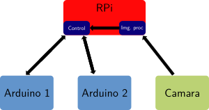

@mainpage Simulador Sistemas Embebidos: Documentación

# Overview
  
Esta es la documentación del proyecto final de la catedra de Programación Orientada a Objetos en C++.

[TOC]

# Objetivos 

El objetivo es simular la comunicación de 2 arduinos y una raspberry. 
Ademas, en la raspberry hay un thread corriendo que representa a una camara
y envia datos de posición a la raspberry.

# Caracteristicas de los SE

## Raspberry

- Intercambia mensajes con los Arduinos: Recibe mediciones de IMU y sensor de distancia
y envia seteo de la bomba de agua.
- Recibe datos del thread de la camara

## Arduino R

- Posee una IMU que mide aceleraciones en 3 ejes
- Tiene conectada una bomba de agua a la cual se le setea la tensión

## Arduino L

- Tiene un sensor de posición laser

# Esquema del programa

El programa principal es el archivo main.cpp, donde se 
disparan los siguientes threads:
- AR: Corre el programa princiapl del Arduino R. 
En el se toman datos de una IMU y se envian a la raspberry. Ademas se leen mensajes que provienen 
de la raspberry para setear actuadores.
- AL: Corre el programa principal del Arduino L. 
En el mismo se toman datos de un sensor de distancia y se envian a la raspberry
- RPI: Corre el thread de la raspberry pi, dentro del cual se corren lo siguientes threads:
	- Main: Corre el programa principal de la raspi, en el mismo se leen datos que
provienen de los arduinos y se envian datos para setear los actuadores.
	- Camara: Lee datos de posición de la camara y los envia al programa principal de la raspi
- Quit: Revisa si el usuario quiere terminar la simulacion (enter) en caso de querer terminar cierra todos los threads. 
	
Para la generación de los datos de la IMU y la camara se leen archivos .txt con los datos de aceleración y posición.
En el caso del sensor de distancia, se generan numeros aleatorios para representar la posición medida.

# Comunicaciones

Para simular la comunicación utilizo queue con strings como elementos donde
 voy metiendo los mensajes que quiero mandar a otros dispositivos, y el otro 
dispositivo lee si le corresponde y si le corresponde lo pop, sino no hace nada.

Las siguientes queue se utilizan:
- queue 1: Comunicación entre los arduinos y raspi
- queue 2: Comunicación entre la raspi y la camara

## Envio de datos
A continuación se muestra la estructura de los mensajes de cada dispositivo.
### IMU

!DAT:IMU:xxxx:yyyy:zzzz:#

### CAMERA

!DAT:CAM:xxxx:yyyy:zzzz:#

### LASER

!DAT:LAS:xxxx:#
